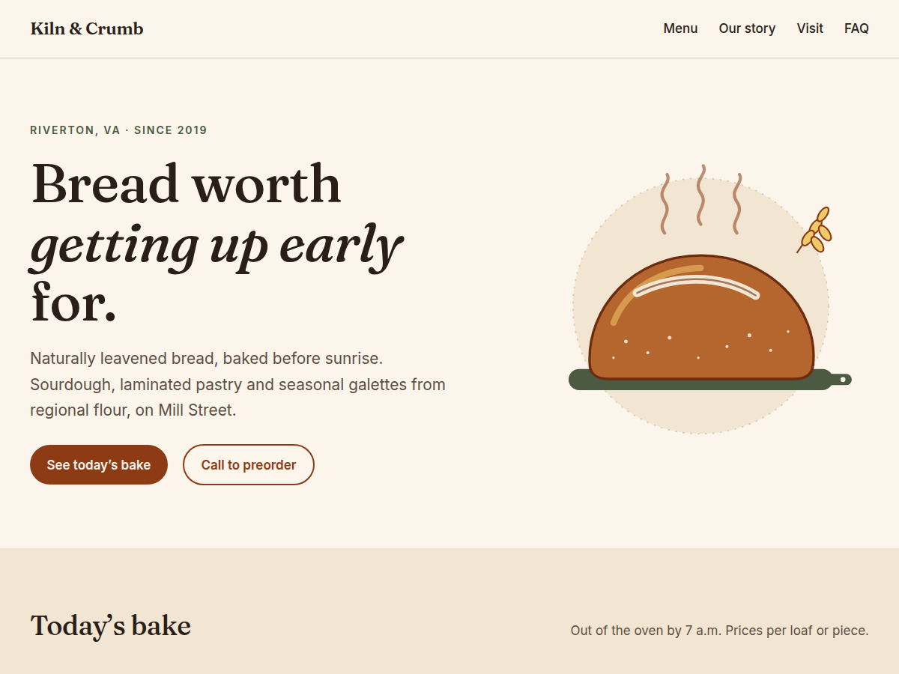

# Kiln & Crumb: WordPress block theme + pre-launch QA kit

A fast, accessible WordPress block theme for a neighborhood bakery (a **fictional** concept client), plus the automated checks I run before any site launches.

**Live site:** https://kiln-crumb.vercel.app (static snapshot of the WordPress-rendered pages)
**Editable WordPress demo:** [open in WordPress Playground](https://playground.wordpress.net/?blueprint-url=https://raw.githubusercontent.com/Ibrahem-al/kiln-crumb/main/blueprint.json) (the real theme running in your browser, wp-admin included)



## Results (measured, WordPress 7.1.2, PHP 8.4)

| Check | Result |
|---|---|
| Lighthouse, home, mobile | Performance 98 · Accessibility 100 · Best Practices 100 · SEO 100 |
| Lighthouse, home, desktop | 100 · 100 · 100 · 100 |
| Cumulative Layout Shift | 0 (was 0.218 before the font-preload fix below) |
| axe-core WCAG 2.2 AA | 0 violations, 3 pages × 6 viewports (320–1440px) |
| Horizontal overflow / tap targets < 24px | 0 / 0 |
| Block validity in the editor | 7 patterns, 6 templates, 2 template parts, all valid |
| Structured data | WebSite + Bakery (hours, geo, menu with prices) + FAQPage JSON-LD |
| Crawl files | `robots.txt` → `wp-sitemap.xml`; `/llms.txt` for AI answer engines |

## What's in it

**Theme (`theme/kiln-crumb/`)**, a Full Site Editing block theme:

- **`theme.json` is the design system.** Colors, fluid type scale, spacing scale and button styles are tokens, so the client picks from the brand palette in the editor instead of a free color picker (custom colors are turned off on purpose).
- **Every section is a block pattern** (hero, menu board, story, wholesale CTA, visit/hours, FAQ, footer). The client can rearrange or edit them in the Site Editor, and they show up under "Kiln & Crumb sections" in the inserter.
- **One source of truth for business facts.** `inc/business.php` holds the hours, address, menu and FAQ. The visible page, the JSON-LD and `/llms.txt` are all generated from it, so the hours on the page can never disagree with the hours Google or an AI assistant reads.
- **Performance:** self-hosted variable fonts (3 files, ~130 KB, preloaded), inline SVG art (zero image requests above the fold), emoji script and other `wp_head` bloat removed, no jQuery, no page builder.
- **Accessibility:** WCAG AA contrast on every text color, visible focus rings, native `<details>` FAQ (keyboard and screen reader friendly with zero JavaScript), core's accessible mobile menu, 24px minimum tap targets, reduced-motion respected.
- **SEO / answer engines:** meta description, Open Graph image, canonical, schema.org graph, llms.txt. If the client later installs Yoast or Rank Math, the theme's meta tags step aside automatically so nothing is printed twice.

**QA kit (`qa/`)**

| Script | What it does |
|---|---|
| `validate-blocks.mjs` | Logs into wp-admin and parses every pattern/template in the real block editor. Catches the classic AI-generated WordPress bug: markup that renders fine but shows the client "This block contains unexpected or invalid content." |
| `audit.mjs` | Every page × 6 widths: overflow, axe-core WCAG 2.2 AA, tap targets, heading order, console errors; SEO tags; JSON-LD types; robots/sitemap/llms.txt; keyboard test of the mobile menu. Exits non-zero on any finding. |
| `lighthouse.mjs` | Mobile + desktop Lighthouse with a budget (Perf ≥ 90, A11y 100, BP ≥ 95, SEO 100). |

## What the checks caught (and how each was fixed)

These came up during the build; each is fixed and noted in the code where it lives.

1. **Layout shift, CLS 0.218 on the home page.** Lighthouse traced it to the italic Fraunces file arriving late and reflowing the hero headline. Fix: preload the italic alongside the other two fonts (`functions.php`). CLS is now 0.
2. **Tap targets under 24px on mobile.** The site title (19px tall) and the phone/email links (20px) failed WCAG 2.5.8. Fix: stand-alone links get padding to reach 24px (`style.css`).
3. **Meta description too long** (167 characters, gets truncated in results). Rewritten to 155 and made more local ("Riverton, VA").
4. **Hours table looked boxed and heavy** because core's default table style added full borders. Caught on the screenshot review; overridden with row rules only.

## Run it locally

**Option A: Local (easiest).** Install [Local](https://localwp.com), create a site, copy `theme/kiln-crumb` into `wp-content/themes/`, then right-click the site → *Open site shell* and run:

```bash
bash /path/to/kiln-crumb/scripts/setup-content.sh
```

**Option B: WordPress Playground CLI** (no install beyond Node):

```bash
cd theme/kiln-crumb
npx @wp-playground/cli@latest server --auto-mount
# then, in wp-admin, activate "Kiln & Crumb" (demo pages come from scripts/setup-content.sh or blueprint.json)
```

**Run the QA kit** against any URL, local or live:

```bash
cd qa
npm install
BASE=http://localhost:8080 WP_USER=admin WP_PASS=yourpass npm run qa
```

Run Lighthouse against the real host before launch; local dev servers skip compression and caching, which skews performance.

## Deploying the static snapshot to Vercel

Vercel doesn't run PHP, so `site/` holds the HTML WordPress renders, exported by `scripts/export-static.py` (it drops `?ver=` query strings, rewrites the local URL to the public one, and strips links to dynamic endpoints like the REST API and feeds). `vercel.json` serves `site/` with no build step.

After changing the theme:

```bash
# with the local WordPress running on :8080
python3 scripts/export-static.py --src http://localhost:8080 --dest site --public-url https://kiln-crumb.vercel.app
git add site && git commit -m "Re-export static site" && git push   # Vercel redeploys on push
```

For a real client this would be hosted WordPress (managed host, or headless WordPress). The static export is just for a fast public portfolio demo.

## Re-skinning for the next client

1. Replace `inc/business.php` (name, hours, address, menu/services, FAQ).
2. Replace the palette and fonts in `theme.json` (and the font files in `assets/fonts/`).
3. Swap the SVGs in `assets/img/` for the client's photography (use the Image block with width/height set to keep CLS at 0).
4. Change `"@type": "Bakery"` in `inc/seo.php` to the right schema.org type (`Plumber`, `Dentist`, `LegalService`...).
5. Run `npm run qa`. Ship when it's green.

## Structure

```
theme/kiln-crumb/
  theme.json            design tokens + block styles
  style.css             theme header + the few rules theme.json can't express
  functions.php         setup, font preload, head cleanup, SVG helper
  inc/business.php      business facts (single source of truth)
  inc/seo.php           meta/OG tags, JSON-LD, /llms.txt
  inc/demo-content.php  demo pages (used by setup script + Playground)
  patterns/*.php        page sections
  templates/*.html      front page, page, single, index, 404
  parts/*.html          header, footer
qa/                     validate-blocks, audit, lighthouse
scripts/setup-content.sh
scripts/export-static.py  WordPress -> static files for Vercel
site/                   the exported static site (what Vercel serves)
vercel.json
blueprint.json          WordPress Playground demo
```

Kiln & Crumb is fictional; the phone number uses the 555-01xx range reserved for fiction. Fonts: Fraunces and Inter (SIL Open Font License).
